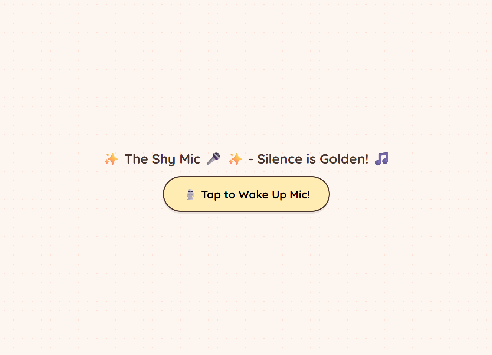
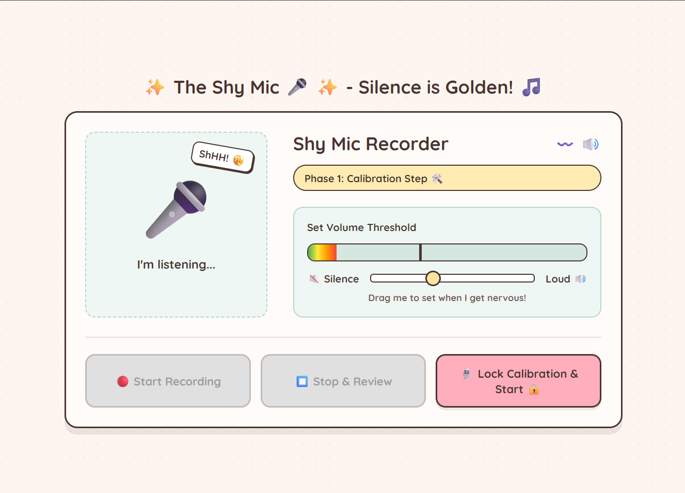
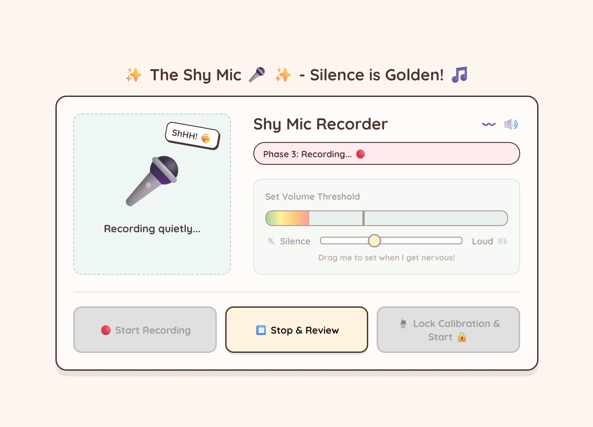

# The Shy Mic 🎤

## Basic Details

### Team Name
Solo Project

### Team Member
- Aman Ubaid Said - Government Engineering College Thrissur

### Project Description
The Shy Mic is a playful browser-based microphone recorder that gets nervous when the sound becomes too loud. It monitors microphone volume, mutes the microphone briefly when the selected threshold is crossed, and lets the user listen to the recording afterward.

### The Problem (that doesn't exist)
Some microphones are too confident and keep listening even when the room gets unexpectedly loud.

### The Solution (that nobody asked for)
The Shy Mic uses a user-selected volume threshold to decide when it has heard enough. When the sound is too loud, it hides for a few seconds before returning to its quiet recording duties.

## Technical Details

### Technologies Used
- HTML5
- CSS3
- JavaScript
- Web Audio API for volume analysis
- MediaRecorder API for recording and playback
- Google Fonts (Quicksand)

### Features
- Microphone permission and live volume monitoring
- Adjustable sensitivity threshold
- Automatic temporary muting when the sound is too loud
- Start and stop recording controls
- In-browser audio playback after recording
- Responsive, playful user interface

## How to Run

No installation or build step is required.

1. Clone or download this repository.
2. Open `shymic.html` in a modern browser.
3. Click **Tap to Wake Up Mic!** and allow microphone access.
4. Set the sensitivity threshold, lock the calibration, and start recording.

For best browser compatibility, serve the folder with a local web server instead of opening the file directly:

```bash
python -m http.server
```

Then open `http://localhost:8000/shymic.html`.

## Project Structure

```text
useless_project_temp/
├── shymic.html   # Main application
├── index.html    # Project entry point placeholder
└── README.md     # Project documentation
```

## Privacy Note

Audio is processed and recorded in the browser. The project does not upload recordings to a server. Microphone access is requested only after the user clicks the wake-up button.

## Team Contribution

Aman Ubaid Said: project idea, user interface, microphone volume analysis, recording workflow, testing, and documentation.

---

Made by Aman Ubaid Said at Government Engineering College Thrissur.

## Build Process

1. Created the page structure and controls with HTML5.
2. Styled the interface with CSS, including the volume meter, calibration controls, and microphone status states.
3. Added JavaScript to request microphone access and analyze live audio with the Web Audio API.
4. Added the MediaRecorder workflow for starting, stopping, and playing back recordings.
5. Connected the sensitivity slider to the mute threshold and tested the app in a modern browser.

## Project Photos

Add project screenshots to a `screenshots` folder using these filenames:

```text
screenshots/
├── shy-mic-welcome.png       # Welcome screen before microphone access
├── shy-mic-calibration.png   # Live volume meter and sensitivity control
└── shy-mic-recording.png     # Recording and playback interface
```

Recommended README entries after adding the images:

```markdown



```

